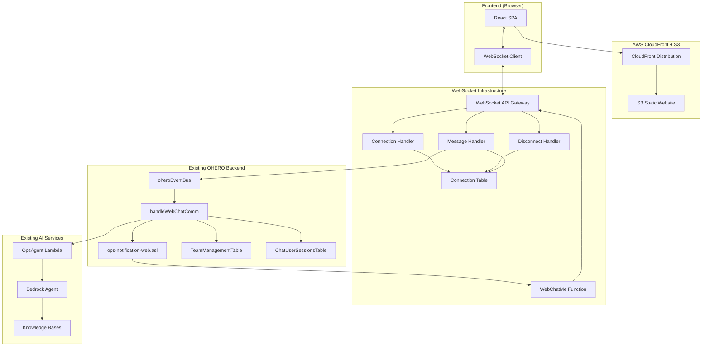

# Design Document

## Overview

The web chat interface adds a browser-based alternative to OHERO's existing Slack integration, providing users with direct access to the AI-powered operational health assistant without requiring Slack access. The design follows the existing event-driven architecture patterns and reuses established infrastructure components while introducing minimal new dependencies.

The solution consists of a React-based Single Page Application (SPA) hosted on AWS CloudFront with S3 distribution, connected to a WebSocket API Gateway that integrates with the existing OHERO backend through new Lambda functions and Step Functions, following the established patterns of the current Slack integration.

## Architecture

### High-Level Architecture



### Component Integration with Existing System

The web chat interface integrates with the existing OHERO system by:

1. **Reusing Event Patterns**: Following the same event-driven architecture as the Slack integration
2. **Leveraging Existing Tables**: Using TeamManagementTable and ChatUserSessionsTable
3. **Extending Step Functions**: Creating ops-notification-web.asl based on ops-notification.asl
4. **Reusing AI Services**: Connecting to the same OpsAgent Lambda and Bedrock services
5. **Following CDK Patterns**: Implementing infrastructure using established stack patterns

### Message Flow Comparison

**Slack Integration Flow**:
```
User → Slack → API Gateway → handleSlackComm → EventBridge → handleWebChatComm → AI Agent
AI Response → EventBridge → ops-notification.asl → SlackMe → Slack → User
```

**Web Chat Integration Flow**:
```
User → WebSocket → MessageHandler → EventBridge → handleWebChatComm → AI Agent
AI Response → EventBridge → ops-notification-web.asl → WebChatMe → WebSocket → User
```

**Key Differences**:
- **MessageHandler** (WebSocket) ≈ **handleSlackComm** (processes inbound messages)
- **WebChatMe** ≈ **SlackMe** (sends outbound messages)
- **ops-notification-web.asl** ≈ **ops-notification.asl** (orchestrates responses)
- Same **handleWebChatComm** and **AI Agent** for processing logic

## Components and Interfaces

### Frontend Components

#### 1. Vanilla TypeScript Single Page Application (SPA)

**Technology Stack**:
- Plain TypeScript/JavaScript with DOM manipulation
- CSS for styling (no frameworks)
- WebSocket API for real-time communication
- HTML5 with semantic markup
- No external dependencies beyond TypeScript compiler

**Core Classes and Interfaces**:

```typescript
// Main application class
class WebChatApp {
  private channels: Channel[] = []
  private activeChannel: string | null = null
  private connectionStatus: ConnectionStatus = 'connecting'
  private wsManager: WebSocketManager
  private ui: UIManager
  
  constructor()
  init(): void
  loadChannels(): Promise<void>
  switchChannel(channelId: string): void
  sendMessage(channelId: string, message: string, threadId?: string): void
}

// Channel representation
interface Channel {
  id: string
  name: string
  teamId: string
  messages: Message[]
  isLoading: boolean
}

// Message structure matching Slack patterns
interface Message {
  id: string
  text: string
  timestamp: string
  threadId?: string
  parentMessageId?: string
  userId: string
  userName: string
  isFromBot: boolean
  replies?: Message[]
}

// WebSocket message types
interface WebSocketMessage {
  type: 'message' | 'thread_reply' | 'channel_join' | 'connection_ack'
  channelId: string
  threadId?: string
  content: string
  timestamp: string
}

// UI Management class
class UIManager {
  private container: HTMLElement
  
  constructor(containerId: string)
  renderChannels(channels: Channel[]): void
  renderMessages(channelId: string, messages: Message[]): void
  renderConnectionStatus(status: ConnectionStatus): void
  attachEventListeners(): void
  showTypingIndicator(channelId: string, isTyping: boolean): void
}
```

**Key Features**:
- Multi-channel interface with tabs or sidebar navigation
- Thread-based messaging similar to Slack
- Real-time message updates via WebSocket
- Connection status indicators
- Message queuing during disconnections
- Responsive design using CSS Grid/Flexbox
- DOM-based rendering with efficient updates

#### 2. WebSocket Client Manager

```typescript
class WebSocketManager {
  private ws: WebSocket | null = null
  private messageQueue: WebSocketMessage[] = []
  private reconnectAttempts = 0
  private maxReconnectAttempts = 5
  
  connect(): Promise<void>
  disconnect(): void
  sendMessage(message: WebSocketMessage): void
  onMessage(callback: (message: WebSocketMessage) => void): void
  onConnectionChange(callback: (status: ConnectionStatus) => void): void
  
  private handleReconnection(): void
  private processMessageQueue(): void
}
```

### Backend Components

#### 1. WebSocket API Gateway

**Configuration**:
- Regional WebSocket API Gateway
- Three routes: $connect, $disconnect, $default
- Integration with Lambda functions for each route
- CORS configuration for web browser access

**Route Handlers**:

```typescript
// Connection establishment (equivalent to Slack app verification)
interface ConnectHandler {
  validateConnection(event: APIGatewayWebSocketEvent): boolean
  storeConnection(connectionId: string, userId?: string): Promise<void>
  loadUserChannels(userId?: string): Promise<Channel[]>
  sendInitialData(connectionId: string, channels: Channel[]): Promise<void>
}

// Inbound message processing (equivalent to handleSlackComm)
interface MessageHandler {
  parseMessage(event: APIGatewayWebSocketEvent): WebSocketMessage
  validateMessage(message: WebSocketMessage): boolean
  forwardToEventBridge(message: WebSocketMessage): Promise<void>
  // Note: This does NOT broadcast - that's handled by WebSocketSender
}

// Connection cleanup
interface DisconnectHandler {
  removeConnection(connectionId: string): Promise<void>
  cleanupUserSession(connectionId: string): Promise<void>
}

// Outbound message sender (equivalent to SlackMe Lambda)
interface WebChatMe {
  sendToConnection(connectionId: string, message: any): Promise<void>
  broadcastToChannel(channelId: string, message: any): Promise<void>
  sendThreadReply(connectionId: string, channelId: string, threadId: string, message: any): Promise<void>
}
```

#### 2. Connection Management

**DynamoDB Table Structure**:
```typescript
interface WebSocketConnection {
  PK: string // connectionId
  SK: string // "CONNECTION"
  userId?: string
  connectedAt: string
  lastActivity: string
  channels: string[] // List of channel IDs user has access to
  ttl: number // Auto-cleanup after 24 hours
}
```

**Connection Manager**:
```typescript
class ConnectionManager {
  async storeConnection(connectionId: string, metadata: ConnectionMetadata): Promise<void>
  async getConnection(connectionId: string): Promise<WebSocketConnection | null>
  async removeConnection(connectionId: string): Promise<void>
  async getChannelConnections(channelId: string): Promise<WebSocketConnection[]>
  async broadcastToChannel(channelId: string, message: any): Promise<void>
  async sendToConnection(connectionId: string, message: any): Promise<void>
}
```

#### 3. Web Chat Communication Handler

**Lambda Function**: `handleWebChatComm`
- Based on existing `handleSlackComm` pattern
- Processes web chat events from EventBridge (not direct WebSocket events)
- Handles message threading and channel routing
- Manages user session state
- Invokes AI agent and processes responses

```typescript
interface WebChatCommHandler {
  processWebChatEvent(event: EventBridgeEvent): Promise<void>
  createAIAgentRequest(message: WebSocketMessage): Promise<void>
  handleThreadMessage(message: WebSocketMessage): Promise<void>
  validateChannelAccess(userId: string, channelId: string): Promise<boolean>
  updateChatSession(sessionData: ChatSession): Promise<void>
}
```

#### 4. WebChat Message Sender

**Lambda Function**: `WebChatMe` (equivalent to `SlackMe`)
- Sends messages back to WebSocket clients
- Called by ops-notification-web.asl Step Function
- Handles connection management and message delivery
- Supports both direct messages and channel broadcasts

```typescript
interface WebChatMe {
  sendMessage(event: StepFunctionEvent): Promise<void>
  sendToConnection(connectionId: string, message: any): Promise<void>
  broadcastToChannel(channelId: string, message: any): Promise<void>
  sendThreadReply(connectionId: string, channelId: string, threadId: string, message: any): Promise<void>
  handleConnectionError(connectionId: string, error: Error): Promise<void>
}
```

**Event Bridge Integration**:
```json
{
  "version": "0",
  "id": "web-chat-message-id",
  "detail-type": "Chat.WebMessageReceived",
  "source": "com.app.ohero.web-chat",
  "detail": {
    "connectionId": "abc123",
    "channelId": "general",
    "threadId": "1642248000.123456",
    "messageText": "What's the status of the EC2 performance issue?",
    "userId": "web-user-123",
    "timestamp": "2025-01-15T16:00:00Z"
  }
}
```

#### 4. Web Notification Step Function

**State Machine**: `ops-notification-web.asl`
- Based on existing `ops-notification.asl` pattern
- Handles web-specific message formatting
- Manages WebSocket message delivery
- Supports threading and channel-based routing

**Key States**:
```json
{
  "CheckEventType": {
    "Type": "Choice",
    "Choices": [
      {
        "Variable": "$['detail-type']",
        "StringEquals": "OpsAgent.Responded",
        "Next": "SendWebChatResponse"
      },
      {
        "Variable": "$['detail-type']",
        "StringEquals": "Chat.WebMessageReceived",
        "Next": "ProcessWebMessage"
      }
    ]
  },
  "SendWebChatResponse": {
    "Type": "Task",
    "Resource": "arn:aws:states:::lambda:invoke",
    "Parameters": {
      "FunctionName": "${WebChatMeFunction}",
      "Payload": {
        "connectionId.$": "$.detail.connectionId",
        "channelId.$": "$.detail.channelId",
        "threadId.$": "$.detail.threadId",
        "message.$": "$.detail.aiResponseText"
      }
    }
  }
}
```

### Data Models

#### 1. Channel Configuration

Reuses existing `TeamManagementTable` structure:
```typescript
interface TeamConfiguration {
  PK: string // "TEAM#{teamId}"
  teamName: string
  channelId: string
  channelName: string
  isActive: boolean
  webChatEnabled: boolean // New field for web chat access
}
```

#### 2. Web Chat Sessions

Extends existing `ChatUserSessionsTable`:
```typescript
interface WebChatSession {
  PK: string // "WEBSESSION#{connectionId}"
  SK: string // "SESSION"
  userId?: string
  channelId: string
  threadId?: string
  lastActivity: string
  messageHistory: Message[]
  expiresAt: number // TTL
}
```

#### 3. Message Threading

```typescript
interface MessageThread {
  threadId: string
  parentMessageId: string
  channelId: string
  messages: Message[]
  participants: string[]
  lastActivity: string
}
```

## Error Handling

### Frontend Error Handling

#### 1. WebSocket Connection Errors
```typescript
class WebSocketErrorHandler {
  handleConnectionError(error: Event): void {
    // Display connection status to user
    // Attempt automatic reconnection
    // Queue messages for retry
  }
  
  handleMessageError(error: MessageEvent): void {
    // Show message delivery failure
    // Retry message sending
    // Fallback to polling if WebSocket fails
  }
}
```

#### 2. Network Resilience
- Automatic reconnection with exponential backoff
- Message queuing during disconnections
- Visual indicators for connection status
- Graceful degradation when WebSocket unavailable

### Backend Error Handling

#### 1. WebSocket API Errors
```typescript
interface WebSocketErrorResponse {
  statusCode: number
  body: {
    error: string
    message: string
    requestId: string
  }
}
```

#### 2. Lambda Function Error Handling
- Retry logic for EventBridge publishing
- Dead letter queues for failed messages
- CloudWatch alarms for error rates
- Graceful handling of malformed messages

#### 3. Step Function Error Handling
```json
{
  "Retry": [
    {
      "ErrorEquals": ["Lambda.ServiceException", "Lambda.AWSLambdaException"],
      "IntervalSeconds": 1,
      "MaxAttempts": 3,
      "BackoffRate": 2
    }
  ],
  "Catch": [
    {
      "ErrorEquals": ["States.ALL"],
      "Next": "HandleWebChatError",
      "ResultPath": "$.error"
    }
  ]
}
```

## Testing Strategy

### Live Environment Testing

The testing approach focuses on real-world usage in the deployed environment with actual user interactions, avoiding the complexity of unit testing frameworks and mocks.

#### 1. Manual User Acceptance Testing
- Deploy to development/staging environment
- Test with real user interactions through web browser
- Verify WebSocket connection establishment and stability
- Test message sending and receiving functionality
- Validate thread-based conversations
- Test channel switching and multi-channel support

#### 2. Real-World Scenario Testing
- User joins multiple channels and sends messages
- AI agent responds with threaded messages
- Multiple browser tabs/windows for same user
- Connection loss and recovery scenarios (disconnect WiFi, etc.)
- Cross-browser compatibility (Chrome, Firefox, Safari, Edge)
- Mobile browser testing for responsive design

#### 3. Integration Verification
- Verify integration with existing TeamManagementTable data
- Test AI agent responses through web chat vs Slack (consistency)
- Validate EventBridge event flow and Step Function execution
- Monitor CloudWatch logs for error patterns
- Test with real AWS Health events and Security Hub findings

#### 4. Performance and Reliability Testing
- Multiple concurrent browser connections
- High message volume scenarios
- Extended connection duration testing
- Network interruption recovery testing
- Browser refresh and reconnection behavior

#### 5. Monitoring and Observability Validation
- CloudWatch metrics collection verification
- Error logging and alerting validation
- Connection count and message throughput monitoring
- Performance bottleneck identification through real usage

## Security Considerations

### Frontend Security

#### 1. WebSocket Security
- WSS (WebSocket Secure) connections only
- Origin validation for WebSocket connections
- Message sanitization and XSS prevention
- Content Security Policy (CSP) headers

#### 2. Authentication Integration
```typescript
interface WebSocketAuth {
  validateConnection(token?: string): Promise<boolean>
  getUserContext(token?: string): Promise<UserContext>
  refreshToken(): Promise<string>
}
```

### Backend Security

#### 1. API Gateway Security
- WebSocket connection authorization
- Rate limiting and throttling
- Request validation and sanitization
- CORS configuration for web origins

#### 2. Lambda Security
- IAM roles with least privilege access
- Input validation and sanitization
- Secure handling of connection IDs
- Audit logging for all operations

#### 3. Data Security
- Encryption at rest for DynamoDB tables
- Encryption in transit for all communications
- Message content filtering through Bedrock Guardrails
- Secure handling of user session data

## Performance Optimization

### Frontend Performance

#### 1. Message Rendering
- Virtual scrolling for large message lists using Intersection Observer
- Lazy loading of message history
- Efficient DOM updates with DocumentFragment
- Debounced typing indicators
- CSS-based animations and transitions

#### 2. WebSocket Optimization
- Message batching for high-frequency updates
- Connection pooling and reuse
- Efficient JSON serialization
- Client-side message caching

### Backend Performance

#### 1. WebSocket API Optimization
- Connection pooling and management
- Efficient message routing
- Batch processing of messages
- Connection cleanup and TTL management

#### 2. Lambda Performance
- ARM64 architecture for cost optimization
- Appropriate memory allocation
- Connection reuse and pooling
- Efficient DynamoDB operations

#### 3. Step Function Optimization
- Parallel processing where possible
- Efficient state transitions
- Minimal payload sizes
- Express workflows for simple operations

## Deployment Strategy

### Infrastructure as Code

Following existing CDK patterns, create new stack with proper cleanup:
```typescript
export class WebChatInterfaceStack extends cdk.Stack {
  public readonly webSocketApi: apigatewayv2.WebSocketApi
  public readonly staticWebsite: s3.Bucket
  public readonly cloudFrontDistribution: cloudfront.Distribution
  
  constructor(scope: Construct, id: string, props: WebChatInterfaceStackProps) {
    // S3 bucket with auto-delete for cleanup
    this.staticWebsite = new s3.Bucket(this, 'WebChatStaticSite', {
      removalPolicy: cdk.RemovalPolicy.DESTROY,
      autoDeleteObjects: true,
      blockPublicAccess: s3.BlockPublicAccess.BLOCK_ALL
    });
    
    // CloudWatch Log Groups with consistent retention and cleanup
    const webSocketLogGroup = new logs.LogGroup(this, 'WebSocketApiLogGroup', {
      logGroupName: `/aws/apigateway/websocket/WebChatApi`,
      retention: logs.RetentionDays.ONE_WEEK,
      removalPolicy: cdk.RemovalPolicy.DESTROY,
    });
    
    // Lambda functions with log groups
    const connectHandler = new lambda.Function(this, 'WebSocketConnect', {
      // ... function config
    });
    
    new logs.LogGroup(this, 'WebSocketConnectLogGroup', {
      logGroupName: `/aws/lambda/${connectHandler.functionName}`,
      retention: logs.RetentionDays.ONE_WEEK,
      removalPolicy: cdk.RemovalPolicy.DESTROY,
    });
    
    // DynamoDB table with cleanup
    const connectionTable = new dynamodb.Table(this, 'WebSocketConnections', {
      removalPolicy: cdk.RemovalPolicy.DESTROY,
      // ... table config
    });
    
    // Step Function with log group
    const webNotificationSfnLogGroup = new logs.LogGroup(this, 'WebNotificationSfnLogs', {
      logGroupName: `/aws/vendedlogs/states/WebNotificationSfnLogs`,
      retention: logs.RetentionDays.ONE_WEEK,
      removalPolicy: cdk.RemovalPolicy.DESTROY,
    });
  }
}
```

### Resource Cleanup Strategy

All AWS resources created by the web chat module will be automatically removed when the CDK stack is destroyed:

#### 1. S3 Buckets
- `removalPolicy: cdk.RemovalPolicy.DESTROY`
- `autoDeleteObjects: true` for automatic object cleanup

#### 2. CloudWatch Log Groups
- `retention: logs.RetentionDays.ONE_WEEK` (matching existing pattern)
- `removalPolicy: cdk.RemovalPolicy.DESTROY`

#### 3. DynamoDB Tables
- `removalPolicy: cdk.RemovalPolicy.DESTROY`
- Point-in-time recovery disabled for development environments

#### 4. Lambda Functions
- Automatic cleanup when stack is destroyed
- Associated log groups explicitly created with destroy policy

#### 5. API Gateway Resources
- WebSocket API and routes automatically cleaned up
- Associated log groups with destroy policy

#### 6. CloudFront Distribution
- `removalPolicy: cdk.RemovalPolicy.DESTROY`
- Automatic cleanup of associated resources

### Deployment Pipeline

1. **Frontend Build**: TypeScript compilation and JavaScript bundling/minification
2. **Backend Deployment**: Lambda functions and Step Functions
3. **Infrastructure**: WebSocket API and CloudFront distribution
4. **Integration Testing**: Automated testing of complete flow
5. **Gradual Rollout**: Feature flags for controlled release

### Monitoring and Observability

#### 1. CloudWatch Metrics
- WebSocket connection counts
- Message processing latency
- Error rates and types
- User engagement metrics

#### 2. Distributed Tracing
- X-Ray tracing for request flows
- Correlation IDs across components
- Performance bottleneck identification
- Error root cause analysis

#### 3. Logging Strategy
- Structured logging with JSON format
- Centralized log aggregation
- Security event logging
- Performance metrics logging