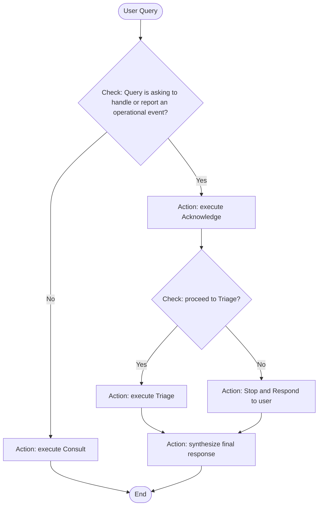

# Operational Health Event Resolution Orchestrator - OHERO
**Boost productivity by using AI in cloud operational health management** - [Link to blog post](https://aws.amazon.com/blogs/machine-learning/boost-productivity-by-using-ai-in-cloud-operational-health-management/)

## Key Features
- **Autonomous Event Processing**: AI-powered virtual operator automatically acknowledges, triages, and creates tickets for AWS Health and Security Hub events following customizable policies
- **Headless Operation**: AI agent can run independently without user interfaces, processing events and taking actions automatically
- **Intelligent Noise Filtering**: Filters operational events based on contextualized organizational policies to reduce alert fatigue
- **Multi-Source Integration**: Processes operational events from AWS Health, Security Hub, and user-reported incidents with unified workflow, a start for adding more event sources. 
- **Auditable Actions**: All AI decisions and actions are logged to S3 with full traceability and compliance reporting
- **Modern AI Stack**: Powered by Amazon Nova and Claude 3.7 Sonnet with prompt caching for optimized performance
- **Event-Driven Architecture**: Highly decoupled microservices that can be configured independently based on your needs

## Main Change Log Since Blog Post
- Refactored agents to use [Strands Agents](https://github.com/strands-agents/sdk-python) for cleaner code and better robustness 
- Flexible Model Selection: Multi-LLM support with automatic fallback for enhanced reliability
- Added standalone web chat option for easy trial and demo use without Slack requirements
- Replaced RAG-based research agent implementation to MCP-based, reducing dependency and cost on self-maintained knowledge base
- Auditable agent action report stored to S3 bucket
- Optimization of Agent long term memory and knowledge retrieval
- Support of user reported free-form operational event as a source
- Support of prompt caching for token usage efficiency
- Old version archived to 'legacy' branch

## Screenshots of Usage

## Architecture Overview

OHERO uses a highly decoupled, event-driven microservices architecture that enables incremental deployment and selective feature activation:

## The OheroACT Framework
The OheroACT Framework defines how OHERO's AI agent processes operational events through three customizable stages: Acknowledge, Consult, and Triage. Each stage has configurable rules, actions, and response formats customizable to your organization's needs.

### OheroACT High-level Flow

## Deployment Guide
- Check the [Deployment Guide](./docs/deployment-guide.md)

## Support

For questions and support:
- Check the [FAQ](./docs/faq.md)
- Review [Event-Driven Architecture](./docs/event-driven-flow.md) documentation
- Open an issue in this repository