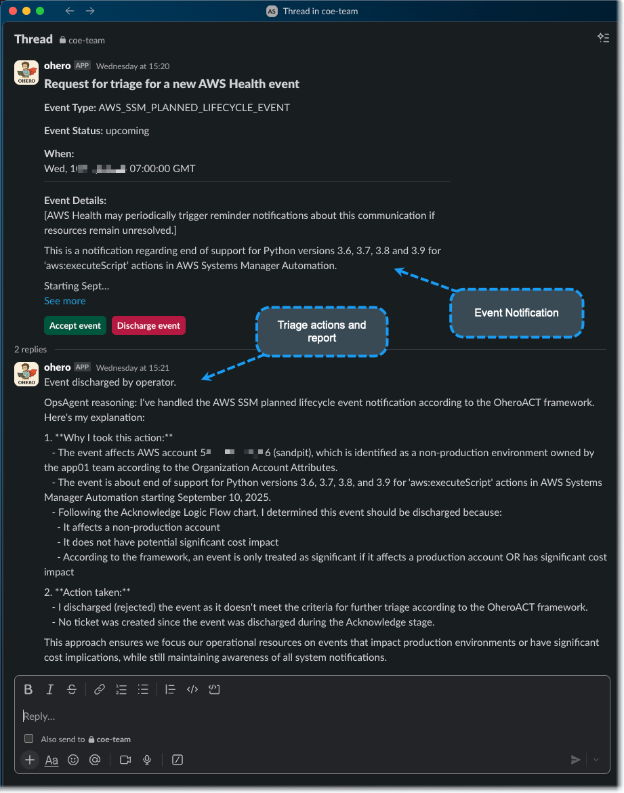
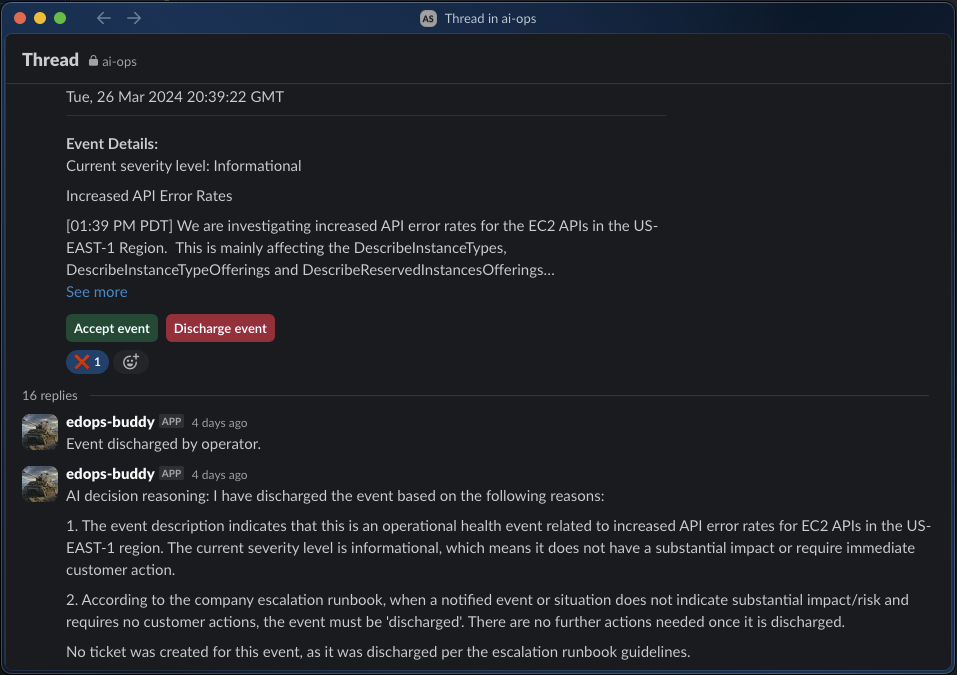
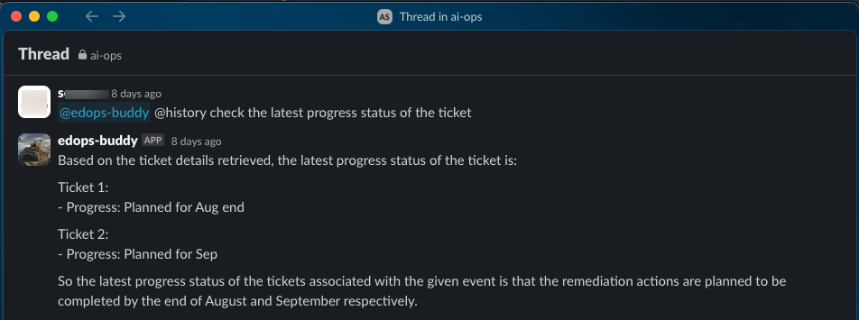
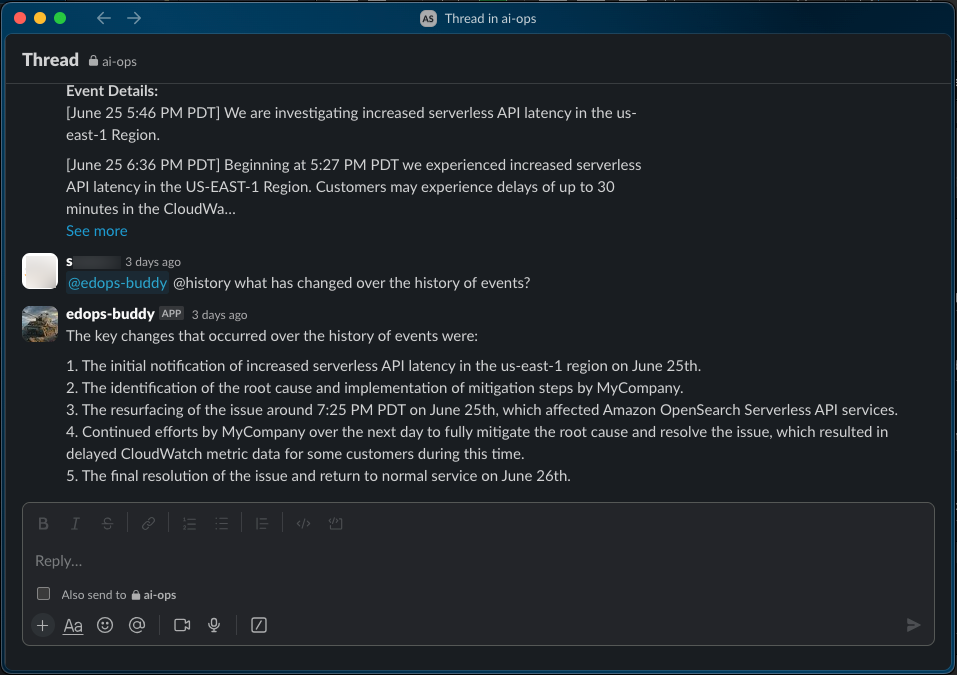
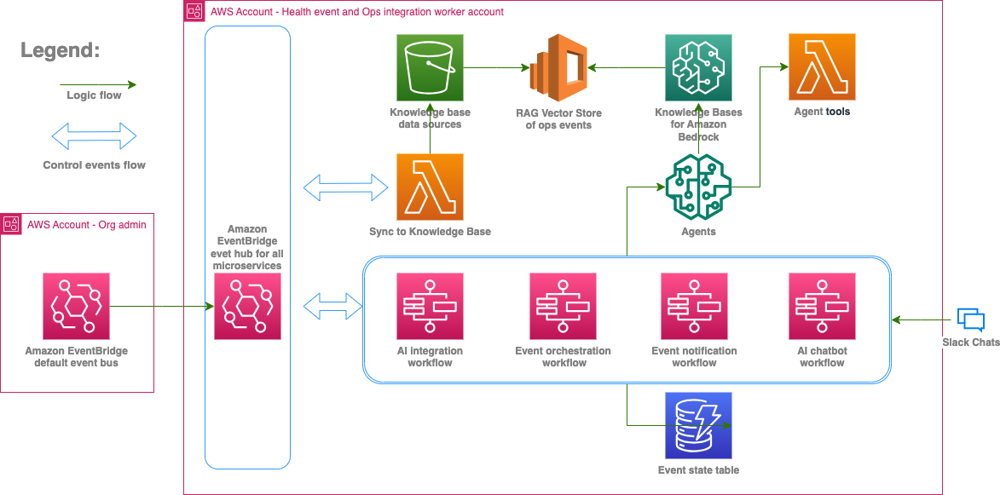

# Managing cloud operational events at scale by AI

- This project is built fully serverless on AWS and deployable using AWS CDK as IaaC (Infrastructure as code).
- A working illustration of how AI can share the heavy-lifting of managing operational events (AWS Health events, Security Hub findings, and more) in complex organizations.
- The project can be used to build further to integrate with more types of events, AWS or non-AWS, using an event-driven architecture (EDA).
- Cost of running/hosting the solution is subject to the actual consumption of queries and the size of vector store, Kendra document libraries (optional) please consult [AWS Bedrock pricing](https://aws.amazon.com/bedrock/pricing/), [AWS OpenSearch pricing](https://aws.amazon.com/opensearch-service/pricing/#Amazon_OpenSearch_Serverless) and [Amazon Kendra pricing](https://aws.amazon.com/kendra/pricing/) for pricing details. 

## Highlights of what is contained
- AI Layer - A microservice that handles the interactions between multiple AWS Bedrock agents, knowledge bases, and user interface (Slack chat)
- Event processing layer - A microservice that handles the notification, acknowledgement, and action triage of operational events.
- Archive and reporting layer - A microservice that manages operational events archive, partitioning, and storage in an operational event lake that serves as the foundation of the knowledge bases used in the AI layer.  
- Slack is used as the primary interface but can be implemented using Microsoft TEAMS.
- A chatbot using Slack as the UI to interact with the backend gen-AI features, similar functionalities can be implemented on MS TEAMS.

## Prerequisites
- At least 1 AWS account with appropriate permissions. The project uses a typical setup of 2 accounts where as 1 is the org admin account and the other is the worker account hosting all the microservices.
- A Slack app and a channel set up with appropriate permissions and event subscriptions to send/receive messages to/from backend microservices.
- AWS CDK installed in your development environment for stack deployment
- AWS SAM (Serverless Application Model) and Docker installed in your development environment to build Lambda packages
  
## Screenshots of Usage
### Automated event notification and autonomous event acknowledgement and action triage by a virtual supervisor/operator that follows MyCompany policies. The virtual operator is equipped with multiple AI agents, each of which is specialized in a domain to help, e.g. generate recommended actions, take actions to create an issue ticket in the company's ticketing system.

</p>

### An example of 'noise' filtered out by the virtual event supervisor/operator according to MyCompany policies

</p>

### An example of AI figuring out the issue tickets associated with the AWS Health event in context and getting the latest progress status of the tickets

</p>

### An example of AI enabled insights from complex event histories

</p>

### A more sophisticated use case

</p>

## Architecture
<p align="left">

</p>

## Deployment steps
### Copy repo to your local directory
```zsh
git clone https://github.com/InitialXW/aws-health-integration.git
cd aws-health-integration
npm install
cdk bootstrap aws://<your admin AWS account id>/<region where you Organization is> aws://<your worker AWS account id>/<region where your worker services to be>
cd lambda/src
# Depending on your build environment, you might want o change the arch type to x84 or arm in lambda/src/template.yaml file before build 
sam build --use-container
cd ../..
```
### Create an '.env' file under project root directory that contains the following
```zsh
CDK_ADMIN_ACCOUNT=<replace with your 12 digits admin AWS account id>
CDK_PROCESSING_ACCOUNT=<replace with your 12 digits worker AWS account id. This account id is the same as the admin account id if using single account setup>
CDK_ADMIN_REGION=<replace with the region where your Organization is, e.g. us-east-1>
CDK_PROCESSING_REGION=<replace with the region where you want the worker services to be, e.g. us-east-1>
SLACK_CHANNEL_HOOK=<your Slack channel webhook url here>
SLACK_CHANNEL_ID=<your Slack channel ID here>
SLACK_CALL_API_KEY=<assign an random api key to be used when initiating Slack webhook calls, all letters>
LIFECYCLE_NOTIFY_EMAIL=<an email address to receive the triaged approval requests for lifecycle type of health events>
OPS_ISSUE_NOTIFY_EMAIL=<an email address to receive the triaged approval requests for operational issue type of health events>
EVENT_HUB_ARN=arn:aws:events:<replace with your region>:<replace with the worker service region>:event-bus/AiOpsStatefulStackAiOpsEventBus
SLACK_APP_VERIFICATION_TOKEN=<replace with your Slack app verification token>
SLACK_ACCESS_TOKEN=<replace with your Slack access token>
```
### Deploy by CDK
```zsh
# deploying processing microservice to your worker account, can be the same account as your admin account
# ensure you are in project root directory
cdk deploy --all --require-approval never
```
## Testing out
### Go to EventBridge console in your chosen admin account, ensure you are in the right region, go to'Event buses' and fire off the below test event that mimic a real Health event. You should receive Slack messages for notification and approval request emails. Then start chatting with your assistant about the test events.
Test event 1 (a lifecycle event)
```json
{
    "eventArn": "arn:aws:health:ap-southeast-2::event/EKS/AWS_EKS_PLANNED_LIFECYCLE_EVENT/Example1",
    "service": "EKS",
    "eventTypeCode": "AWS_EKS_PLANNED_LIFECYCLE_EVENT",
    "eventTypeCategory": "plannedChange",
    "eventScopeCode": "ACCOUNT_SPECIFIC",
    "communicationId": "1234567890abcdef023456789-1",
    "startTime": "Wed, 31 Jan 2024 02:00:00 GMT",
    "endTime": "",
    "lastUpdatedTime": "Wed, 29 Nov 2023 08:20:00 GMT",
    "statusCode": "upcoming",
    "eventRegion": "ap-southeast-2",
    "eventDescription": [
        {
            "language": "en_US",
            "latestDescription": "Amazon EKS has deprecated Kubernetes version 1.2x..."
        }
    ],
    "eventMetadata": {
        "deprecated_versions": "Kubernetes 1.2x in EKS"
    },
    "affectedEntities": [
        {
            "entityValue": "arn:aws:eks:ap-southeast-2:111122223333:cluster/example1",
            "lastupdatedTime": "Wed, 29 Nov 2023 08:20:00 GMT",
            "statusCode": "RESOLVED"
        },
        {
            "entityValue": "arn:aws:eks:ap-southeast-2:111122223333:cluster/example3",
            "lastupdatedTime": "Wed, 29 Nov 2023 08:20:31 GMT",
            "statusCode": "PENDING"
        }
    ],
    "affectedAccount": "111122223333",
    "page": "1",
    "totalPages": "1"
}
```

Test event 2 (an Ops issue event)
```json
{
    "eventArn": "arn:aws:health:global::event/IAM/AWS_IAM_OPERATIONAL_ISSUE/AWS_FAKE_OPERATIONAL_ISSUE_12345_ABCDEFGHIJK",
        "service": "FAKE",
        "eventTypeCode": "AWS_FAKE_OPERATIONAL_ISSUE",
        "eventTypeCategory": "issue",
        "eventScopeCode": "PUBLIC",
        "communicationId": "a76afee0829c473703943fe5e2edd04cb91c6051-1",
        "startTime": "Thu, 22 Feb 2024 01:49:40 GMT",
        "endTime": "Thu, 22 Feb 2024 03:11:08 GMT",
        "lastUpdatedTime": "Thu, 22 Feb 2024 19:39:38 GMT",
        "statusCode": "closed",
        "eventRegion": "global",
        "eventDescription": [
            {
                "language": "en_US",
                "latestDescription": "A test operational issue that is happening to your account."
            }
        ],
        "affectedAccount": "444333222111",
        "page": "1",
        "totalPages": "1"
}
```

