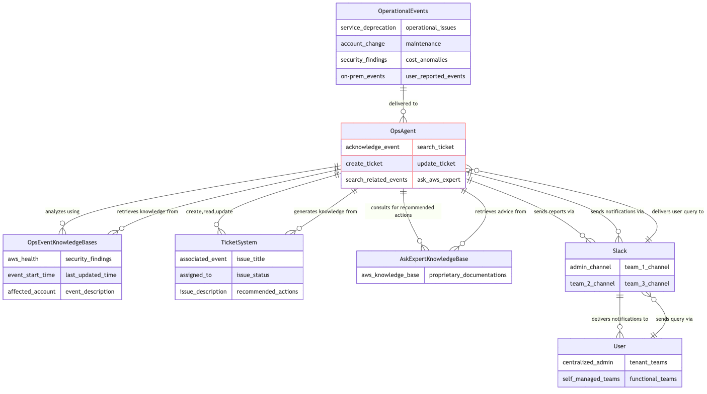

# Managing cloud operational events at scale by AI
[Original blog post](https://aws.amazon.com/blogs/machine-learning/boost-productivity-by-using-ai-in-cloud-operational-health-management/)
## Change log since post
- Modernized underlying LLMs to use Amazon Nova and Claud 3.5 Haiku
- New implementation of the agentic flow to accommodate better customization and remove dependency on Amazon Bedrock Agent.
- Agent actions auditable via reports produced and save in S3
- Removed service dependency on Amazon Kendra - The 'ask-aws' agent now uses Amazon Bedrock Knowledge Bases as the RAG source. It contains the latest AWS documentation on selected topics. You must synchronize the 'AskAwsKnowledgeBase' knowledge base data source use the latest documentation. Your can do this using the [AWS Management Console](https://us-east-1.console.aws.amazon.com/bedrock/home?region=us-east-1#/knowledge-bases) after the solution is deployed (make sure the right region is selected)

## Prerequisites
- At least 1 AWS account with appropriate permissions. The project uses a typical setup of 2 accounts whereas 1 is the organization health administration account and the other is the worker account hosting backend microservices. The worker account can be the same as the administration account if single account setup is chosen. 
- Enable AWS Health Organization view and delegate an administrator account in your AWS management account if you want to manage AWS Health events across your entire AWS Organization. This is optional if you only need to handle events from a single account.
- Enable AWS Security Hub in your AWS management account. Optionally, enable security Hub with Organizations integration  if you want to monitor security findings for the entire organization instead of just a single account.,
- Configure a Slack app and set up a channel with appropriate permissions and event subscriptions to send/receive messages to/from backend microservices.
- AWS CDK installed in your development environment for stack deployment
- AWS SAM (Serverless Application Model) and Docker installed in your development environment to build Lambda packages
  
## How does the solution work
High-level interactions between solution elements

</p>
## Screenshots of Usage
### Automated event notification, autonomous event acknowledgement and action triage by a virtual supervisor/operator that follows MyCompany policies. The virtual operator is equipped with multiple AI capabilities, each of which is specialized in a knowledge domain to assist, such as generating recommended actions, taking actions to create issue tickets in ITSM tools.

</p>

### The virtual event supervisor/operator filters out 'noise' based on MyCompany's policies.

</p>

### AI can identify the issue tickets related to an AWS Health event and provide the latest status updates on those tickets.

</p>

### An illustration of how the assistant can provide valuable insights from complex thread of operational events.

</p>

### A more sophisticated use case

</p>

## Architecture
<p align="left">

</p>

## Deployment steps
### Create a Slack app and set up a channel
1. Create a [Slack app](https://api.slack.com/apps) from the manifest template - copy/paste the content of “slack-app-manifest.json” file included in this repository.
2. Install your app into your workspace, take note of the “Bot User OAuth Token” value to be used in next steps.
3. Take note of the “Verification Token” value under your app’s Basic Information, you will need it in next steps.
4. In your Slack desktop app, go to your workspace and add the newly created app.
5. Create a Slack channel and add the newly created app as an integrated app to the channel, this channel will be used to watch how events arrive and get processed.
6. Create another Slack channel and add the newly created app as an integrated app to the channel, this channel will be used to test out how ticket notifications land in different team channels.
7. Find and take note of the channel id of above channels by right-clicking on the channel name and selecting ‘Additional options’ to access the ‘More’ menu. Within the ‘More’ menu, click on ‘Open details’ to reveal the Channel details.

### Prepare your deployment environment for the worker account
This step is required only if you chose a worker account that is different from the administration account. Make sure you are not running the command under an existing AWS CDK project root directory.
```zsh
# Make sure your shell session environment is configured to access the worker workload
# account of your choice, for detailed guidance on how to configure, refer to 
# https://docs.aws.amazon.com/cli/latest/userguide/cli-chap-configure.html  
# Note that in this step you are bootstrapping your worker account in such a way 
# that your administration account is trusted to execute CloudFormation deployment in
# your worker account, the following command uses an example execution role policy of 'AdministratorAccess',
# you can swap it for other policies of your own for least privilege best practice,
# for more information on the topic, refer to https://repost.aws/knowledge-center/cdk-customize-bootstrap-cfntoolkit
cdk bootstrap aws://<replace with your AWS account id of the worker account>/<replace with the region where your worker services is> --trust <replace with your AWS account id of the administration account> --cloudformation-execution-policies 'arn:aws:iam::aws:policy/AdministratorAccess' --trust-for-lookup <replace with your AWS account id of the administration account>
```

### Prepare your deployment environment for the administration account
Make sure you are not running the command under an existing AWS CDK project root directory.
```zsh
# Make sure your shell session environment is configured to access the administration 
# account of your choice, for detailed guidance on how to configure, refer to 
# https://docs.aws.amazon.com/cli/latest/userguide/cli-chap-configure.html
# Note 'us-east-1' region is required for receiving AWS Health events associated with
# services that operate in AWS global region.
cdk bootstrap <replace with your AWS account id of the administration account>/us-east-1

# Optional, if you have your cloud infrastructures hosted in other AWS regions than 'us-east-1', repeat the below commands for each region
cdk bootstrap <replace with your AWS account id of the administration account>/<replace with the region name, e.g. us-west-2>
```

### Copy repo to your local directory
```zsh
git clone https://github.com/aws-samples/ops-health-ai.git
cd ops-health-ai
npm install
cd lambda/src
# Depending on your build environment, you might want o change the arch type to 'x86'
# or 'arm' in lambda/src/template.yaml file before build 
sam build --use-container
cd ../..
```
### Create an '.env' file under project root directory that contains the following
```zsh
CDK_ADMIN_ACCOUNT=<replace with your 12 digits admin AWS account id>
CDK_PROCESSING_ACCOUNT=<replace with your 12 digits worker AWS account id. This account id is the same as the admin account id if using single account setup>
EVENT_REGIONS=us-east-1,<region 1 of where your infrastructures are hosted>,<region 2 of where your infrastructures are hosted>
CDK_PROCESSING_REGION=<replace with the region where you want the worker services to be, e.g. us-east-1>
EVENT_HUB_ARN=arn:aws:events:<replace with the worker service region>:<replace with the worker service account id>:event-bus/AiOpsStatefulStackAiOpsEventBus
SLACK_CHANNEL_ID=<your admin Slack channel ID here>
MOCKUP_SLACK_CHANNEL_ID=<your team mockup Slack channel ID here>
SLACK_APP_VERIFICATION_TOKEN=<replace with your Slack app verification token>
SLACK_ACCESS_TOKEN=<replace with your Slack Bot User OAuth Token value>
```
### Deploy by CDK
Deploy processing microservice to your worker account, the worker account can be the same as your admin account.
In project root directory, run the following commend:
```zsh
cdk deploy --all --require-approval never
```
Capture the “HandleSlackCommApiUrl” stack output URL, go to your [Slack app](https://api.slack.com/apps) created in previous steps, go to Event Subscriptions, Request URL Change, then update the URL value with the stack output URL and save.

## Testing the solution
### Method 1 - Using AWS CLI
Run below AWS CLIcommand:
```shell
aws events put-events --entries file://test-events/mockup-ops-event.json
aws events put-events --entries file://test-events/mockup-ops-event2.json
aws events put-events --entries file://test-events/mockup-sec-finding.json
```
You will receive Slack messages notifying you about the mockup event and then followed by automatic feedbacks by the AI assistant after a few seconds. You do NOT need to click the “Accept” or “Discharge” buttons included in the message, these buttons are only useful when AI assistant failed to acknowledge the event, they are used as a fallback mechanism for human user to intervene.

### Method 2 - Using AWS Console
Go to EventBridge console in your chosen admin account, ensure you are in the right region, go to 'Event buses' and fire off the below test event that mimic a real Health event. You should receive Slack messages for notification and approval request emails. Then start chatting with your assistant about the test events.
Test event 1 (a lifecycle event)
```json
{
    "eventArn": "arn:aws:health:ap-southeast-2::event/EKS/AWS_EKS_PLANNED_LIFECYCLE_EVENT/Example1",
    "service": "EKS",
    "eventTypeCode": "AWS_EKS_PLANNED_LIFECYCLE_EVENT",
    "eventTypeCategory": "plannedChange",
    "eventScopeCode": "ACCOUNT_SPECIFIC",
    "communicationId": "1234567890abcdef023456789-1",
    "startTime": "Wed, 31 Jan 2024 02:00:00 GMT",
    "endTime": "",
    "lastUpdatedTime": "Wed, 29 Nov 2023 08:20:00 GMT",
    "statusCode": "upcoming",
    "eventRegion": "ap-southeast-2",
    "eventDescription": [
        {
            "language": "en_US",
            "latestDescription": "Amazon EKS has deprecated Kubernetes version 1.2x..."
        }
    ],
    "eventMetadata": {
        "deprecated_versions": "Kubernetes 1.2x in EKS"
    },
    "affectedEntities": [
        {
            "entityValue": "arn:aws:eks:ap-southeast-2:111122223333:cluster/example1",
            "lastupdatedTime": "Wed, 29 Nov 2023 08:20:00 GMT",
            "statusCode": "RESOLVED"
        },
        {
            "entityValue": "arn:aws:eks:ap-southeast-2:111122223333:cluster/example3",
            "lastupdatedTime": "Wed, 29 Nov 2023 08:20:31 GMT",
            "statusCode": "PENDING"
        }
    ],
    "affectedAccount": "111122223333",
    "page": "1",
    "totalPages": "1"
}
```

Test event 2 (an Ops issue event)
```json
{
    "eventArn": "arn:aws:health:global::event/IAM/AWS_IAM_OPERATIONAL_ISSUE/AWS_FAKE_OPERATIONAL_ISSUE_12345_ABCDEFGHIJK",
        "service": "FAKE",
        "eventTypeCode": "AWS_FAKE_OPERATIONAL_ISSUE",
        "eventTypeCategory": "issue",
        "eventScopeCode": "PUBLIC",
        "communicationId": "a76afee0829c473703943fe5e2edd04cb91c6051-1",
        "startTime": "Thu, 22 Feb 2024 01:49:40 GMT",
        "endTime": "Thu, 22 Feb 2024 03:11:08 GMT",
        "lastUpdatedTime": "Thu, 22 Feb 2024 19:39:38 GMT",
        "statusCode": "closed",
        "eventRegion": "global",
        "eventDescription": [
            {
                "language": "en_US",
                "latestDescription": "A test operational issue that is happening to your account."
            }
        ],
        "affectedAccount": "444333222111",
        "page": "1",
        "totalPages": "1"
}
```

## Cleanup
Run the following command in the CDK project directory:
```shell
cdk destroy --all
```


