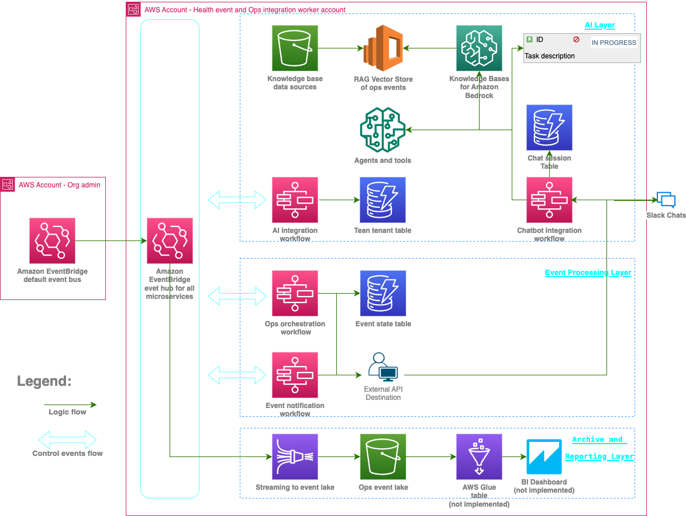

# Operational Health Event Resolution Orchestrator - OHERO
**Boost productivity by using AI in cloud operational health management** - [Link to blog post](https://aws.amazon.com/blogs/machine-learning/boost-productivity-by-using-ai-in-cloud-operational-health-management/)

## Key Features
- **Autonomous Event Processing**: AI-powered virtual operator automatically acknowledges, triages, and creates tickets for AWS Health and Security Hub events following customizable policies
- **Headless Operation**: AI agent can run independently without user interfaces, processing events and taking actions automatically
- **Intelligent Noise Filtering**: Filters operational events based on contextualized organizational policies to reduce alert fatigue
- **Multi-Source Integration**: Processes operational events from AWS Health, Security Hub, and user-reported incidents with unified workflow, a start for adding more event sources. 
- **Auditable Actions**: All AI decisions and actions are logged to S3 with full traceability and compliance reporting
- **Modern AI Stack**: Powered by Amazon Nova and Claude 3.7 Sonnet with prompt caching for optimized performance
- **Event-Driven Architecture**: Highly decoupled microservices that can be configured independently based on your needs

## Main Change Log Since Blog Post
- Added web-based chat deployment option for easy trial use
- Auditable agent action report stored to S3 bucket
- Optimization of Agent long term memory and knowledge retrieval
- Modernized underlying LLMs to use Amazon Nova and Claud 3.7 Sonnet
- User reported operational event as a source
- Support of prompt caching
- Old version archived to 'legacy' branch

## Screenshots of Usage

## Architecture Overview

OHERO uses a highly decoupled, event-driven microservices architecture that supports incremental deployment:

## The OheroACT Framework Practiced by AI
The OheroACT Framework is a set of customizable guidelines and rules that govern how OHERO assistant operates within the context of operational health management. It consists of three main stages: Acknowledge, Consult, and Triage. Each stage has its own customizable set of rules, permitted actions, and output formats.

### OheroACT High-level Flow

## Deployment Guide
- Check the [Deployment Guide](./docs/deployment-guide.md)

## Support

For questions and support:
- Check the [FAQ](./docs/faq.md)
- Review [Event-Driven Architecture](./docs/event-driven-flow.md) documentation
- Open an issue in this repository