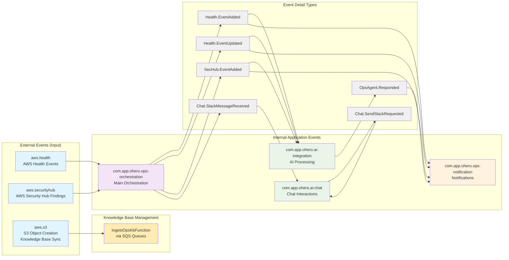
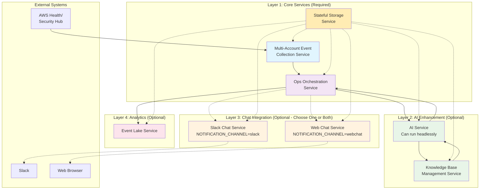
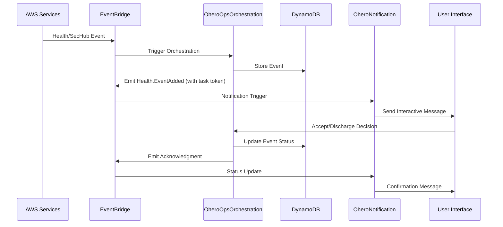
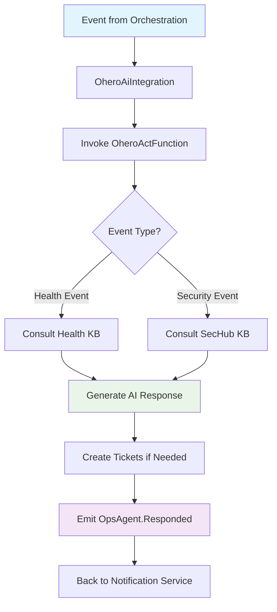
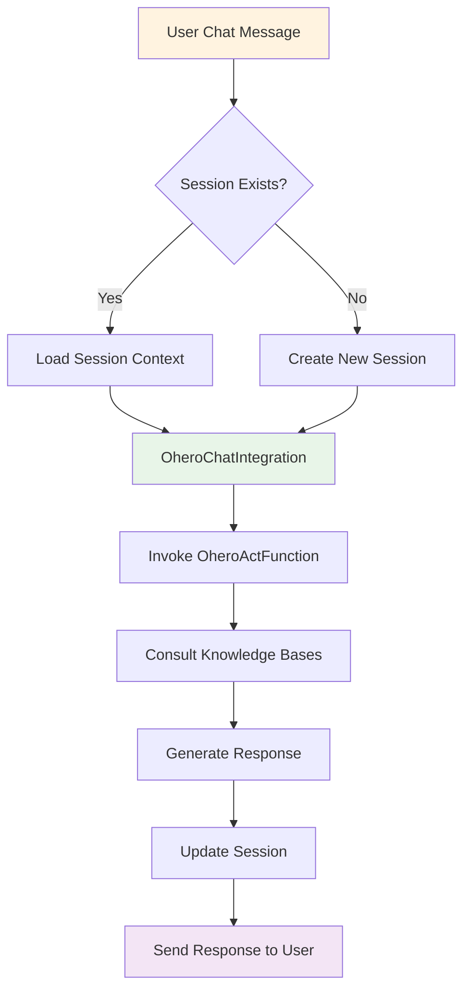
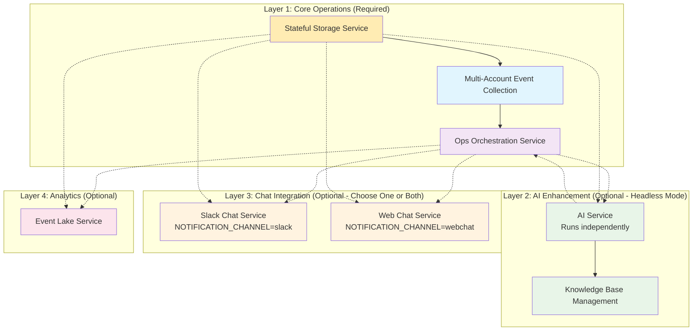
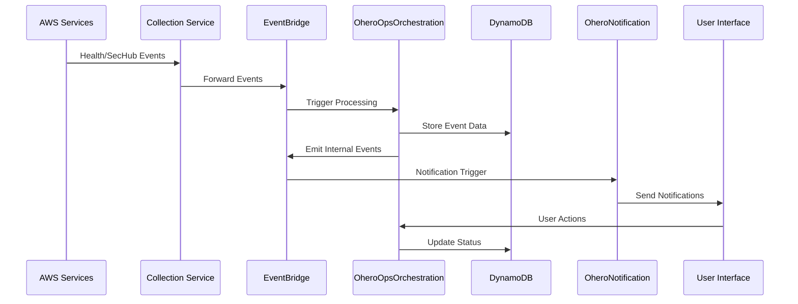
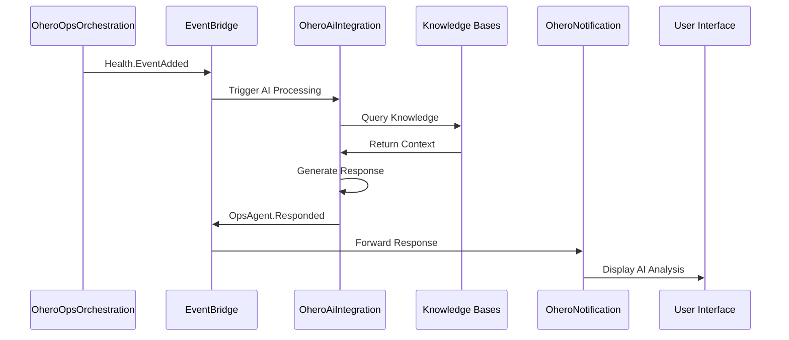
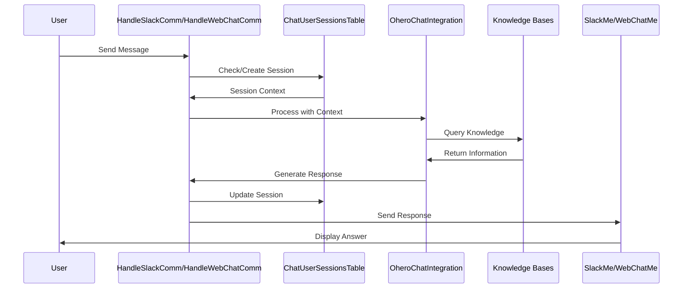
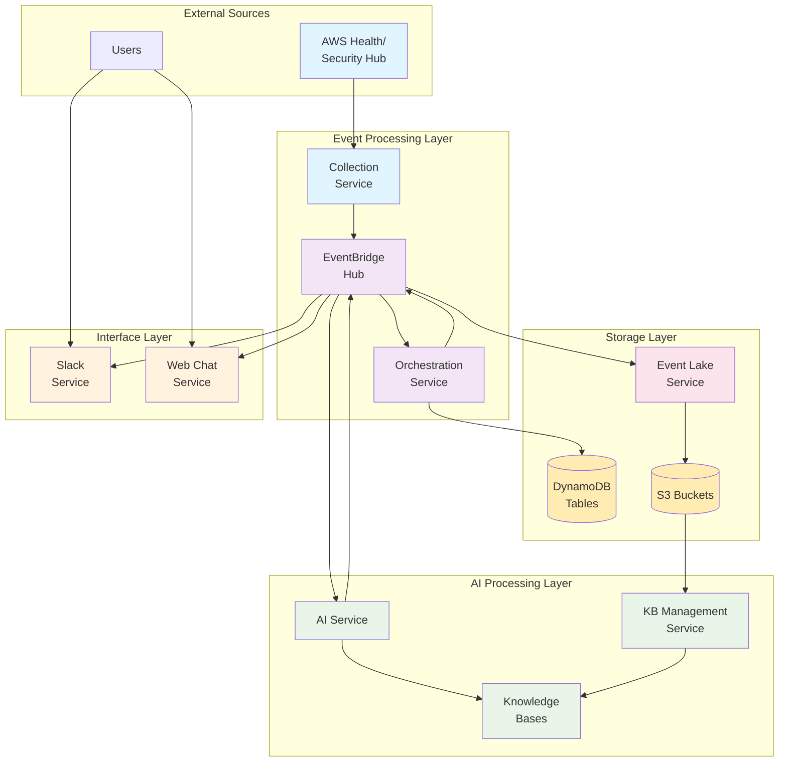

# Event-Driven Architecture and Microservices Flow

## Table of Contents

- [Overview](#overview)
- [Architecture Benefits](#architecture-benefits)
- [Event Types and Flow](#event-types-and-flow)
- [Microservices Architecture](#microservices-architecture)
  - [Service 1: Stateful Storage Service](#service-1-stateful-storage-service)
  - [Service 2: Multi-Account Event Collection Service](#service-2-multi-account-event-collection-service)
  - [Service 3: Ops Orchestration & Notification Service](#service-3-ops-orchestration--notification-service)
  - [Service 4: AI Service](#service-4-ai-service)
  - [Service 5: Slack Chat Service](#service-5-slack-chat-service)
  - [Service 6: Web Chat Service](#service-6-web-chat-service)
  - [Service 7: Event Lake Service](#service-7-event-lake-service)
  - [Service 8: Knowledge Base Management Service](#service-8-knowledge-base-management-service)
- [Layered Deployment Strategy](#layered-deployment-strategy)
- [Event Flow Diagrams](#event-flow-diagrams)

## Overview

OHERO (Operational Health Event Resolution Orchestrator) is built using a highly decoupled, event-driven microservices architecture. This design enables each service to operate independently while communicating through well-defined event contracts via Amazon EventBridge. The architecture supports plug-and-play deployment, allowing you to start with core functionality and progressively add advanced features.

## Architecture Benefits

### Loose Coupling

- **Independent Deployment**: Each service can be deployed, updated, or scaled independently
- **Fault Isolation**: Failure in one service doesn't cascade to others
- **Technology Flexibility**: Services can use different programming languages and frameworks

### Event-Driven Communication

- **Asynchronous Processing**: Services don't block waiting for responses
- **Scalability**: Natural load distribution across services
- **Extensibility**: New services can subscribe to existing events without modifying producers

### Plug-and-Play Architecture

- **Minimal Core**: Start with essential services for manual event handling
- **Progressive Enhancement**: Add AI, chat interfaces, and analytics incrementally
- **Service Independence**: Each service provides value even when others are unavailable

## Event Types and Flow

The system uses a structured event taxonomy with three main categories:

## Microservices Architecture

### Service 1: Stateful Storage Service

**Implementation**: `StatefulStack`
**Purpose**: Provides shared storage and messaging infrastructure for all other services

#### Components:

- **DynamoDB Tables**:

  - `EventManagementTable` - Tracks event processing status
  - `TicketManagementTable` - Manages issue tickets
  - `TeamManagementTable` - Team and channel mappings
  - `WebSocketConnectionsTable` - Active WebSocket connections
  - `ChatUserSessionsTable` - AI chat session state (created in AI Service stack)

- **S3 Buckets**:

  - `OpsHealthBucket` - Operational health knowledge base
  - `SecFindingsBucket` - Security findings knowledge base
  - `OpsEventLakeBucket` - Event data warehouse
  - `TransientPayloadsBucket` - Large event payloads

- **EventBridge Custom Bus**: Central event routing hub (`OheroEventBus`)

#### Event Interactions:

- **Produces**: S3 object creation events
- **Consumes**: None (foundational service)
- **Dependencies**: None

---

### Service 2: Multi-Account Event Collection Service

**Implementation**: `OrgAdminOrgStack`
**Purpose**: Collects operational events from multiple AWS accounts in an organization

#### Components:

- **EventBridge Rules**: Cross-account event forwarding (`OheroEventHubForwardingRule`)
- **Lambda Functions**:
  - `SecHubReportFunction` - Scheduled Security Hub findings export (Python 3.11, only deployed in ap-southeast-2 region)
- **IAM Roles**: Cross-account access permissions
- **EventBridge Schedule**: Cron-based scheduling for Security Hub reports (daily at 15:00 UTC)

#### Event Interactions:

- **Produces**: Forwards `aws.health` and `aws.securityhub` events to central bus
- **Consumes**: Native AWS service events
- **Dependencies**: Stateful Storage Service (for event bus)

#### Deployment Pattern:

Deployed in each AWS account/region where you want to collect events. Can operate independently - if this service is unavailable, other services continue processing manually submitted events.

---

### Service 3: Ops Orchestration & Notification Service

**Implementation**: `OpsOrchestrationStack`
**Purpose**: Core event processing workflow with manual triage capabilities

#### Components:

- **Step Functions**:

  - `OheroOpsOrchestration` - Main event processing state machine
  - `OheroNotification` - Slack notification workflow (conditional deployment based on `NOTIFICATION_CHANNEL=slack`)
  - `OheroWebChatNotification` - Web chat notification workflow (conditional deployment based on `NOTIFICATION_CHANNEL=webchat`)

- **Lambda Functions**:

  - `HandleSlackComm` - Processes Slack interactions (Node.js 20.x, ARM64)
  - `HandleWebChatComm` - Processes WebSocket messages (Node.js 20.x, ARM64)
  - `SlackMe` - Sends Slack messages (Python 3.11, ARM64)
  - `WebChatMe` - Sends WebSocket messages (Python 3.12, ARM64)
  - `EventCallback` - Handles manual triage decisions (Node.js 20.x, ARM64)

- **API Gateway**: REST endpoints for callbacks (`OheroRestEndpoints`) and WebSocket API (`OheroWebSocketApi`)

#### Event Interactions:

- **Produces**:
  - `Health.EventAdded`, `Health.EventUpdated`, `SecHub.EventAdded`
  - `Health.EventAddedAcknowledged`, `Chat.SlackMessageReceived`
- **Consumes**:
  - `aws.health`, `aws.securityhub` (from collection service)
  - `OpsAgent.Responded` (from AI service)
- **Dependencies**: Stateful Storage Service

#### State Machine Workflows:

---

### Service 4: AI Service

**Implementation**: `OpsHealthAgentStack`
**Purpose**: AI-powered automatic reaction to operational events

#### Components:

- **Bedrock Knowledge Bases**:

  - `OpsHealthKnowledgeBase` - Health event knowledge (Titan Embed Text v2, no chunking)
  - `OpsSecHubKnowledgeBase` - Security findings knowledge (Titan Embed Text v2, fixed size chunking)

- **Lambda Functions**:

  - `OheroActFunction` - Main AI agent processing (Python 3.11, ARM64, 900s timeout, 1 concurrent execution)
  - `IngestOpsKbFunction` - Knowledge base synchronization (Node.js 20.x, ARM64)

- **Step Functions**:

  - `OheroAiIntegration` - Event processing with AI
  - `OheroChatIntegration` - Interactive chat with AI

- **SQS Queues**: Buffer knowledge base sync operations (`BufferHealthKbSyncSqs`, `BufferSechubKbSyncSqs`)
- **DynamoDB Table**: `ChatUserSessionsTable` - AI chat session state with TTL

#### Event Interactions:

- **Produces**: `OpsAgent.Responded`
- **Consumes**:
  - `Health.EventAdded`, `Health.EventUpdated`, `SecHub.EventAdded`
  - `Chat.SlackMessageReceived`, `Chat.SendSlackRequested`
  - S3 object creation events (for knowledge sync)
- **Dependencies**: Stateful Storage Service

#### AI Processing Flow:

#### Chat Processing Flow:

---

### Service 5: Slack Chat Service

**Implementation**: Part of `OpsOrchestrationStack`
**Purpose**: Slack integration for user interaction

#### Components:

- **Lambda Functions**:

  - `HandleSlackComm` - Processes Slack events and interactions
  - `SlackMe` - Sends messages to Slack channels

- **Step Functions**:
  - `OheroNotification` - Slack-specific notification workflow

#### Event Interactions:

- **Produces**: `Chat.SlackMessageReceived`
- **Consumes**: `OpsAgent.Responded`, orchestration events
- **Dependencies**: Ops Orchestration Service

#### Integration Features:

- Interactive message blocks with action buttons
- Threaded conversations for event tracking
- Slash command support for AI chat
- Real-time event notifications

---

### Service 6: Web Chat Service

**Implementation**: `WebFrontendStack` + `OpsOrchestrationStack`
**Purpose**: Web-based chat interface as Slack alternative

#### Components:

- **WebSocket API Gateway**: Real-time communication (`OheroWebSocketApi` with routes: `$connect`, `$disconnect`, `$default`, `message`)
- **Lambda Functions**:

  - `HandleWebChatComm` - WebSocket message handling (Node.js 20.x, ARM64)
  - `WebChatMe` - Sends messages to web clients (Python 3.12, ARM64)

- **CloudFront + S3**: Static web frontend with Origin Access Identity
- **Step Functions**: `OheroWebChatNotification` - Web-specific notifications
- **Build Process**: TypeScript compilation and asset deployment during CDK synthesis

#### Event Interactions:

- **Produces**: Web chat message events
- **Consumes**: `OpsAgent.Responded`, orchestration events
- **Dependencies**: Ops Orchestration Service

#### Features:

- Real-time WebSocket communication
- Interactive UI for event triage
- Team-based access control
- Responsive web interface

---

### Service 7: Event Lake Service

**Implementation**: `OpsEventLakeStack`
**Purpose**: Data warehousing for operational events and analytics

#### Components:

- **Kinesis Data Firehose**: Streaming data ingestion (`OpsEventLakeFirehose`) with dynamic partitioning
- **S3 Bucket**: Partitioned event storage (uses `OpsEventLakeBucket` from Stateful Stack)
- **EventBridge Rules**: Event capture rules (`OpsEventLakeRule`)
- **IAM Role**: `FirehoseDeliveryRole` for S3 access permissions

#### Event Interactions:

- **Produces**: None (data sink)
- **Consumes**: All health and security hub events
- **Dependencies**: Stateful Storage Service

#### Data Organization:

- Dynamic partitioning by event source and type
- Compressed storage with lifecycle policies
- Ready for analytics with Athena/QuickSight
- Error handling with separate error prefixes

---

### Service 8: Knowledge Base Management Service

**Implementation**: Distributed across multiple stacks
**Purpose**: Manages ingestion and synchronization of operational knowledge

#### Components:

- **Lambda Functions**: `IngestOpsKbFunction` (in AI Service, Node.js 20.x, ARM64)
- **S3 Event Triggers**: Automatic sync on file changes (`OpsKbFileArrivalRule`)
- **Bedrock Data Sources**: 
  - `OpsHealthDataSource` (S3-based, no chunking)
  - `OpsSecHubDataSource` (S3-based, fixed size chunking)
- **SQS Queues**: Buffered sync operations (`BufferHealthKbSyncSqs`, `BufferSechubKbSyncSqs`)

#### Event Interactions:

- **Produces**: Knowledge base sync events
- **Consumes**: S3 object creation events
- **Dependencies**: Stateful Storage Service, AI Service

#### Sync Process:

1. S3 object creation triggers event
2. SQS buffers sync requests
3. Lambda processes batched sync operations
4. Bedrock knowledge bases updated
5. AI agents get fresh knowledge

## Layered Deployment Strategy

The architecture supports incremental deployment in layers:

**Layer 1: Core Operations (Required)**

- **Services**: Stateful Storage, Multi-Account Event Collection, Ops Orchestration
- **Capabilities**: Manual event triage, basic workflow, event routing
- **Value**: Immediate operational event management

**Layer 2: AI Enhancement (Optional - Headless Mode)**

- **Services**: AI Service, Knowledge Base Management
- **Capabilities**: Automated event analysis, AI recommendations, ticket creation
- **Value**: Reduced manual effort, expert knowledge assistance
- **Note**: AI runs headlessly - no user interface required

**Layer 3: Chat Integration (Optional - Choose One)**

- **Services**: Slack Chat Service OR Web Chat Service (mutually exclusive)
- **Capabilities**: Interactive user interfaces, chat-based AI interaction
- **Value**: User-friendly interfaces for monitoring and interaction
- **Configuration**: Set `NOTIFICATION_CHANNEL=slack` or `webchat` 
- **Conditional Deployment**: Web Frontend Stack (`OheroWebFrontendStack`) only deploys when `NOTIFICATION_CHANNEL=webchat`

**Layer 4: Analytics (Optional)**

- **Services**: Event Lake Service
- **Capabilities**: Historical analysis, reporting, compliance tracking
- **Value**: Data-driven insights and audit trails

## Event Flow Diagrams

### Primary Event Flow

### AI-Enhanced Flow

### Chat Interaction Flow

### Complete System Integration

This event-driven architecture ensures that OHERO can scale from a simple manual triage system to a sophisticated AI-powered operational platform, with each service providing independent value while contributing to the overall solution capability.
