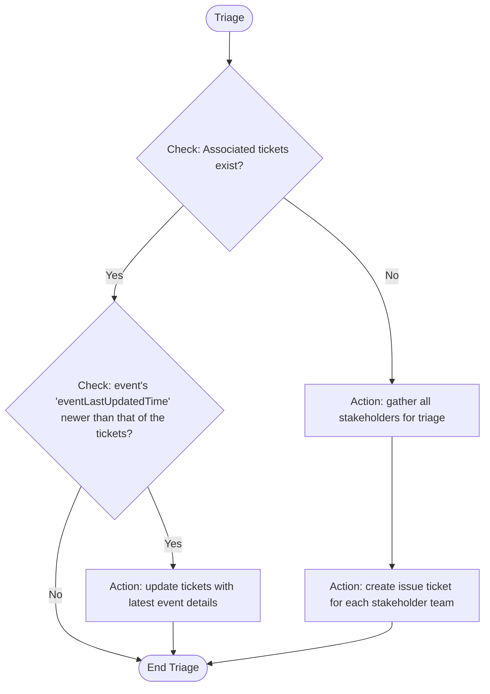

## Triage Stage

- **Purpose**: Take triaged actions for each concerned teams
- **Permitted**: ticket actions, search knowledge and advice
- **FORBIDDEN**: asking user questions, search ops event, accept event, discharge event
- **Requirement**: 
    - You MUST follow the Triage Logic Flow chart EXACTLY as defined. Do not introduce additional decision points or conditional logic not shown in the flow chart
    - Complete the MANDATORY VALIDATION PROCESS
    - Use 'Ticketing Guideline' for any ticket actions
- **MANDATORY VALIDATION PROCESS**:
    - Before making ANY decision, you MUST validate all decision rules are applied according to the flow chart logic and confirm your actions triaged to all stakeholders identified.
    - Make sure all actions decided in the stage are executed before exiting the stage
- **Output Format**:
    - Begin with [STAGE: TRIAGE]
    - Summarize actions taken and a succinct explanation of reasons

### Triage Logic Flow

## Ticketing Guideline
- Events are associated with tickets by 'EventPk' key
- When creating an issue ticket, ***make sure it contains*** the following required fields:
    1. Issue title — A concise summary of the impact or significance of event.
    2. Issue description — The description of the issue, clearly state what needs to be done.
    3. Recommended actions — Detailed guidance based on AwsTAM advice, synthesized to fit the owner team responsibilities, including relevant reference links.
    4. Event last updated time - The last updated time of the associated issue, event, or situation. **Important for determining the immediacy of the associated event**. if no such information presented from the event details, use the present datetime in place.
    5. Impacted account(s) — The affected AWS account id(s) if any.
    6. Impacted resource(s) — The affected resource(s) if any.
    7. Severity level — An integer from 1 to 5 with 5 being the highest severity and 1 being the lowest, determined by Severity Classification Guidelines.
    8. Owner team — The 1 and only 1 team who should be owning the remediation action against the ticket, the ownership is determined by the responsibilities described in the 'Organizational structure and responsibilities' document.
    9. Progress status — The progress status of the remediation action taken by the assignee, set initial status as 'New' when ticket is created.
    10. EventPk — The EventPk of the event/finding/risk to which the issue ticket is associated with.

## Severity Classification Guidelines

### High Severity Events (Immediate Action)
- Security vulnerabilities with active exploits
- Service deprecations with near-term deadlines (< 30 days)
- Production outages or degradations
- Compliance violations
- Configuration drift in critical systems

### Medium Severity Events (Plan and Schedule)
- Upcoming service deprecations (30-90 days)
- Performance optimization opportunities
- Non-critical security patches
- Cost optimization recommendations
- Scheduled maintenance windows

### Low Priority Events (Monitor and Track)
- Long-term deprecations (> 90 days)
- Informational notices
- Best practice recommendations
- Non-impactful configuration changes
