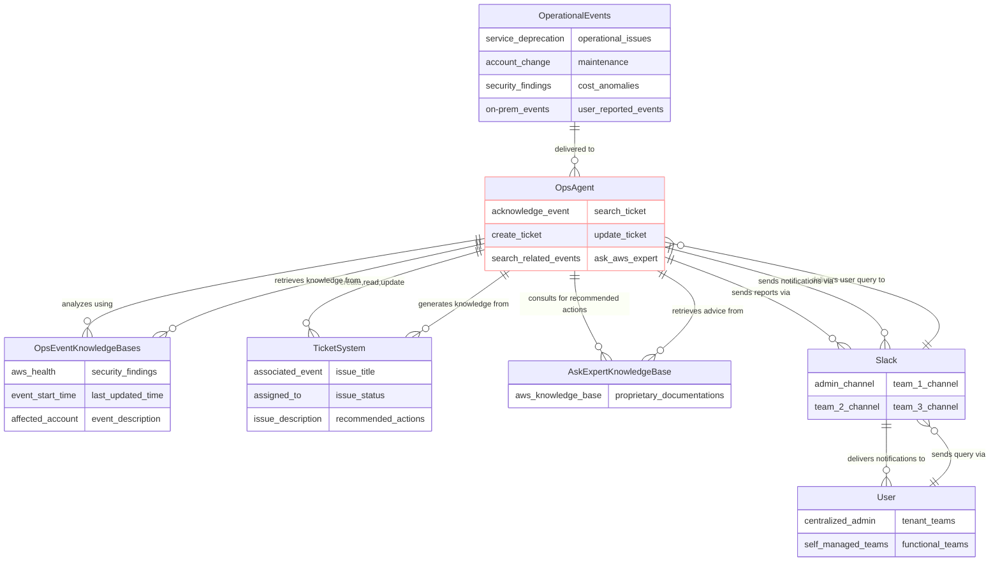

```mermaid
%% Title and Description
%% AWS Ops Health AI Solution Architecture
%% # Operation event handling flow
%% 1. An operational event happens
%% 2. the event gets delivered to OpsAgent
%% 3. OpsAgent analyzes the event content by connecting to the history event knowledge base and ticket system
%% 4. OpsAgent takes actions such as create, update ticket based on the analyses and it consults AskExpert knowledge base for remediation guidelines
%% 5. OpsAgent send report of actions and results via Slack

%% # User chat handling flow
%% 1. User sends query to OpsAgent via Slack
%% 2. OpsAgent generated response to user query by connecting to history event knowledge base, AskExpert knowledge base, and ticket tools
%% 3. OpsAgent sends synthesized response back to user via Slack

erDiagram
    OperationalEvents ||--o{ OpsAgent : "delivered to"
    OpsAgent ||--o{ OpsEventKnowledgeBases : "analyzes using"
    OpsAgent ||--o{ TicketSystem : "create,read,update"
    OpsAgent ||--o{ AskExpertKnowledgeBase : "consults for recommended actions"
    OpsAgent ||--o{ Slack : "sends reports via"
    User ||--o{ Slack : "sends query via"
    Slack ||--o{ OpsAgent : "delivers user query to"
    OpsAgent ||--o{ OpsEventKnowledgeBases : "retrieves knowledge from"
    OpsAgent ||--o{ AskExpertKnowledgeBase : "retrieves advice from"
    OpsAgent ||--o{ TicketSystem : "generates knowledge from"
    OpsAgent ||--o{ Slack : "sends notifications via"
    Slack ||--o{ User : "delivers notifications to"

    OperationalEvents {
        service_deprecation operational_issues
        account_change maintenance
        security_findings cost_anomalies
        on-prem_events user_reported_events
    }

    OpsAgent {
        acknowledge_event search_ticket
        create_ticket update_ticket
        search_related_events ask_aws_expert
    }

    OpsEventKnowledgeBases {
        aws_health security_findings
        event_start_time last_updated_time
        affected_account event_description
    }

    TicketSystem {
        associated_event issue_title
        assigned_to issue_status
        issue_description recommended_actions
    }

    AskExpertKnowledgeBase {
        aws_knowledge_base proprietary_documentations
    }

    Slack {
        admin_channel team_1_channel
        team_2_channel team_3_channel
    }

    User {
        centralized_admin tenant_teams
        self_managed_teams functional_teams
    }

    %% Styling classes for each entity type
    classDef opsAgentStyle stroke:#FF9999

    %% Apply styling to entities
    class OpsAgent opsAgentStyle
```

