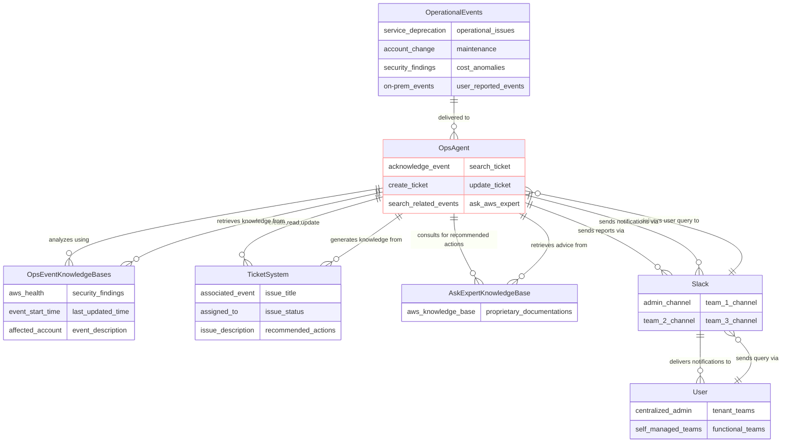

# Demo runbook
- Deployment and environment setup
- Trigger test event 1 - a triaged example, explain what is in the event.
    1. my admin channel will receive a notification about the event
    2. explain traditionally how the event will be processed by a human admin
    3. explain how the work is now handled by an AI agent.
    4. check in the other channel how the team is informed about a ticket created.
    5. show the system prompt how 'company escalation runbook' played the role
- Trigger event 2 and explain it is an updated event on the same thread as event 1
    1. explain traditionally how such update is triaged
    2. look at how the AI agent triaged the update instead
- Trigger test event 3 - a discharged example, explain how this is different from event 1 and 2
    1. explain how agent has triaged this time
- Trigger test event 4 and explain the logic of triage
    1. check in the other channel how a ticket is assigned to the team
- use @history to ask a followup question regarding why the ticket was created?
- use the past example to show a long thread of events and explain how the updates were triaged. 
- show agent report in S3 for auditing purpose
- summarize demo by asking 'who are you'
- explain how the same concept can be applied to beyond just AWS Health events.

# Solution diagram    

